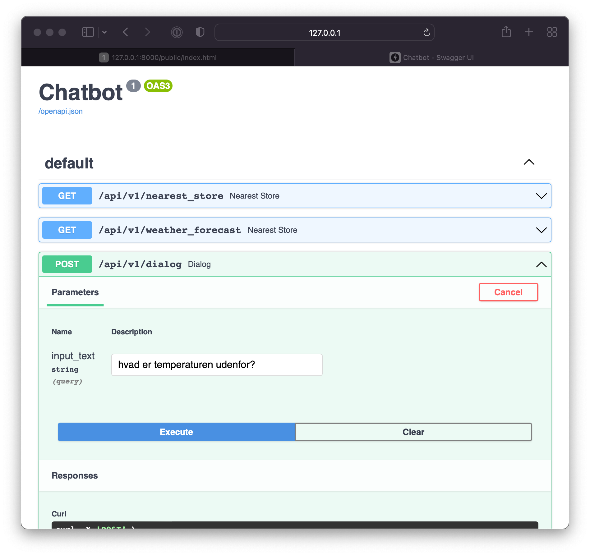

# CIC - Chatbot project
## Table of content:
- [Installation](#Installation)
- [Reflections](#Reflections)
- [Chatbot Case Study](#chatbot-case-study)

<table>
  <tr>
    <td align="middle">Index page - Chatbot window <br>http://127.0.0.1:8000/public/index.html</td>
    <td align="middle">Swagger page - <br>http://127.0.0.1:8000/docs </td>
  </tr>
  <tr>
    <td></td>
    <td></td>
  </tr>
 </table>

## Installation

For running in development mode locally:
```bash
python3 -m uvicorn server.main:app --reload`
```

For running in development mode locally using Docker:
```bash
docker build -t CIC-Chatbot . && docker run -p 8000:8000 -ti CIC-Chatbot:latest
```

---

## Reflections over things that could be improved
### Data
- Currently the data is stored as `.json` files in nearly every folder. This could easily be fixed with having a NoSQL db such as mongoDB
- All of the inputs from any given user is currently only available during the session of the interaction. This is obviously not expected if a Bewhaos wants user statistics intent hits based on user inputs. Saving those inputs in abovementioned MongoDB would benefit the service in a lot of ways.

### Methods
- When working with Chatbots, there are way more sophisticated approaches that would make it much easier to scale the content of the chatbot. Nowadays chatbots are trained using Natural Language Processing and even though I didn't go down that route, some of the principals could be beneficial for a project such as this. One of the things could be utilizing would be lemmatization and stemming of words (e.g. by utilizing a library such as this: [Lemmatizer for Danish](https://github.com/sorenlind/lemmy). 
- The approach of calculating the nearest location of the store relative to the user didn't go as planned, as I ran out of time before making the logic for dialogue flows. Therefore, unless Swagger is used, the location will always be based in Aarhus. In addition, the method for calculating the _great-circle distance_ is faulty in the sense that it doesn't account for the distance traveled by e.g. car.

### Scaling
- Increasing the dialogue options as fast as I did, it became harder in the long run fulfilling the user stories, as other intents would seem to have a higher accuracy than before increasing the amount of possible dialogue. Proper testing classes for each important user story could have assisted in at least keeping the obvious questions aligned with the correct response. 
- However, the strict need for Use-case testing could  largely be avoided if Natural Language Processing were utilized, as there are a wide range of paths one can take to ensure the model doesn't underfit or overfit. Which, in contrary, is not as straight forward when going down the road with  simple binary classification, as used in this project.    


---
Chatbot case study
------
### Roles
- Frontend
- Backend
- Fullstack

 Description
------
One day, you and your team get contacted by a customer service department in a hardware store (Bewhaos A/S). They want a chatbot for managing all customer inquries through their website.
The customer service bot should either be able to be imported into the website, or work as a seperate site which customers can access/get redirected to so forth they have any questions.
You decide how the bot should answer questions and where it should get it's data from. Frameworks are acceptable and encouraged.
## Tasks
all tasks are described as “user stories” - simply put a user wants to be able to do this, you come up with how they are going to do it. **You’re not meant to do all stories but as many as you can and in no particular order.**
### Directions
It is fine to hard code the questions accepted by the chatbot and relevant
### Conversation
| Frontend | Backend | User story                                                                                                                                                      |
| ------------ |---------|-----------------------------------------------------------------------------------------------------------------------------------------------------------------|
|      ✅  |      ✅  | Bewhaos wants the bot to be able to greet the customer upon starting the application and respond with simple politeness gestures as well as respond to goodbye. |
|      ✅  |     ✅ | A customer would like an easy to way to find out what the chatbot can do and how it can help him                                                                |
|      ✅  |     ✅ | A customer enquires about available hammer products . Asking the chatbot, the bot returns a list of links to an assortment of hammers of different brands.      |
|      ✅  |     ✅ | A customer enquires about available screwdriver products. Asking the chatbot, the bot replies that no screwdrivers are in stock.                                |
|         |      | Bewhaos would like to handle media with their chatbot. They want to be able to send images and videos through the chatbot.                                      |
|      ✅  |      ✅| [Feel free to come up with other interesting or elaborate concversation scenarios]                                                                              |

### Configuration dashboard
| Frontend | Backend | User story                                                                                                                                                      |
| ------------ |---------|-----------------------------------------------------------------------------------------------------------------------------------------------------------------|
|        |      ⚠️ | A customer service rep wants to inform the bot about new product lines, and enters a configuration dashboard, where he can publish a link for the new product line making it available for the bot to crawl. |
|        |         | A customer asks a question for which the chatbot does not know the answer. The bot reports this to the configuration dashboard and creates a notification for the customer service team.|
|        |         | A customer service rep logs in to the configuration dashboard to see new notifications from the chatbot. The customer service rep. finds a question about garden furniture which the chatbot has made a report on, and fixes the error by grouping the input request with other garden furniture questions.|

### Nearest store lookup
| Frontend | Backend | User story                                                                                                                                                      |
|----------|---------|-----------------------------------------------------------------------------------------------------------------------------------------------------------------|
|      ✅   |      ✅  | A customer wants to visit the store, but is unsure about the weather - he wants to ask the bot about the weather (BACKEND)|
|      ⚠️  |      ⚠️ | A customer wants to know where the nearest store is|
|          |         | A customer wants displayed by the bot where the nearest store is (FRONTEND)|

